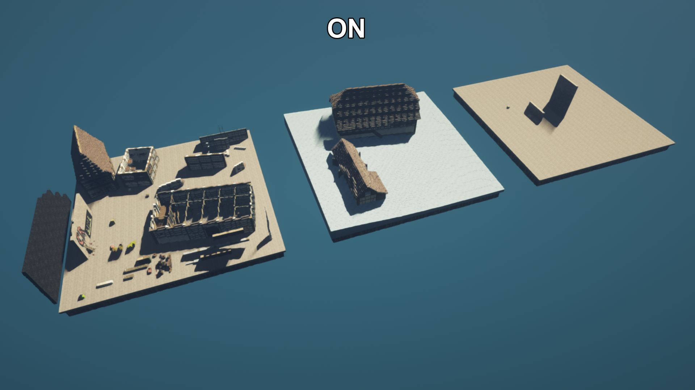
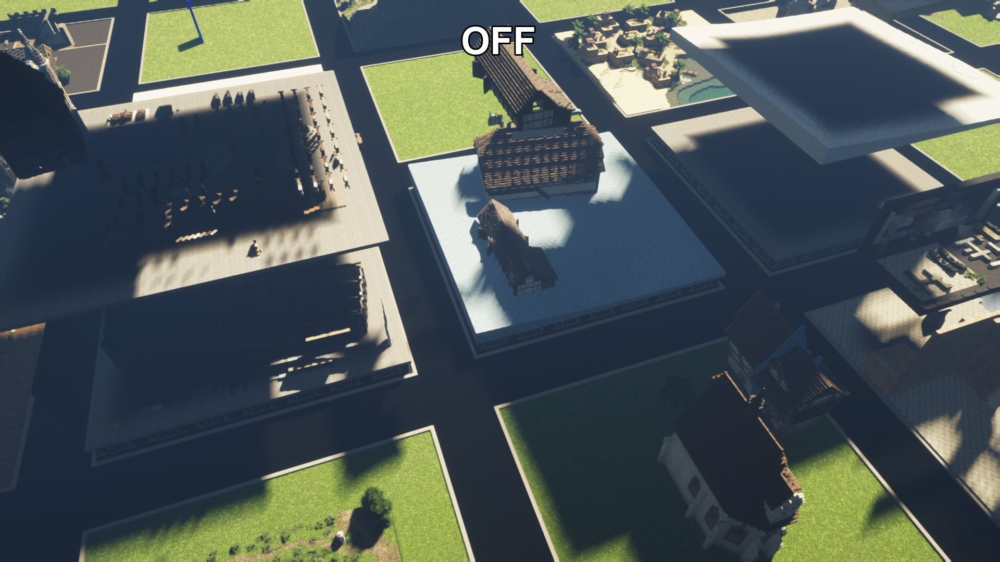

# Selective Render

[Download Selective Render on Modrinth](https://modrinth.com/mod/selective-render)

<p align="center">
  
  
</p>

Selective Render is a client-side Fabric mod for Minecraft 1.20.1. It keeps loaded
chunks, network traffic, world state, and collision unchanged while removing
everything outside selected three-dimensional block regions from the render lists.
This prevents hidden buildings and terrain from contributing geometry, lighting,
or shader shadows outside the selected area. Player visibility is configurable;
other entities, block entities, particles, block models, and fluids are
restricted to the active regions.

For requests regarding support for other Minecraft versions, contact `cepreni` on Discord.

## Usage

`/sr` is the short alias for `/selectiverender`; both command names provide the
same features.

1. Stand at one corner of the desired cuboid and run `/sr pos1`.
2. Stand at the diagonally opposite corner and run `/sr pos2`.
3. Run `/sr s NAME` to save the inclusive cuboid and activate it immediately.
4. Save additional regions or use `/sr t NAME` to add existing presets to the render group.
5. Run `/sr t` to enable or disable the complete render group at once.

Both positions use whole-block X, Y, and Z coordinates. Make sure the two corners
cover the full width, height, and depth you want to render. For example, one
position can be the lower north-west corner and the other the upper south-east
corner. The order of `pos1` and `pos2` does not matter, and both boundary blocks
are included.

Available short commands:

```text
/sr pos1  # alias: /sr 1
/sr pos2  # alias: /sr 2
/sr s NAME
/sr t NAME
/sr t all  # alias: /sr t a
/sr h NAME
/sr h
/sr h all  # alias: /sr h a
/sr d NAME
/sr r OLDNAME NEWNAME
/sr list
/sr list h
/sr l h
```

- `/sr s NAME` saves the current selection and immediately activates it. A name
  is always required and must not already exist.
- `/sr t NAME` toggles a preset in the render context. Using it on a hide preset
  moves that preset back to the regular render context.
- `/sr t` enables or disables the entire render group while preserving its members.
- `/sr t all` or `/sr t a` deselects every regular preset when any are selected; when none are
  selected, it selects all regular presets.
- Global render toggles and the render keybind use a HUD overlay instead of chat.
- `/sr h NAME` registers a preset in the hide context and toggles its selected state.
- `/sr h` enables or disables the entire hide group while preserving its members.
- `/sr h all` or `/sr h a` deselects every hide preset when any are selected; when none are
  selected, it selects all registered hide presets.
  Global hide toggles and the hide keybind use a HUD overlay instead of chat.
- `/sr d NAME` permanently deletes a preset.
- `/sr r OLDNAME NEWNAME` renames a preset while preserving its group memberships.
- `/sr list` displays regular presets on separate lines with status and a corner coordinate.
- `/sr list h`, `/sr list hidden`, `/sr l h`, or `/sr l hidden` exclusively displays hide-group regions in the same format.

The long `save`, `toggle`, `hide`, `delete`, and `rename` subcommands remain available as
`/sr save NAME`, `/sr toggle NAME`, `/sr hide NAME`, `/sr delete NAME`, and
`/sr rename OLDNAME NEWNAME`.

All regions in the enabled render group are combined. A block is rendered when
it is inside at least one of them, so separate areas can be visible at the same
time. Active hide regions are then subtracted from that result. When the normal
render group is disabled, the hide group can remove regions from the full world.

Default keybinds:

- `F8`: toggle the render group
- `F9`: toggle the hide group
- Unassigned: set Pos1, set Pos2, toggle the current PlotSquared region, and open settings

All keybinds can be reassigned in Minecraft's Controls settings under the
Selective Render category.

Preset arguments support tab completion for toggle, hide, delete, and rename
commands. Chat feedback uses a compact `SR:` prefix; list entries are grouped
under a single header without repeating the prefix on every line.
The preset names `all` and `a` are reserved for group commands.

## PlotSquared integration

Servers running the optional [Selective Render Plots](https://modrinth.com/plugin/selective-render-plots)
can provide their exact PlotSquared regions, including merged and non-rectangular plots.
Plot integration is part of the normal Selective Render command tree:

- `/selectiverender plot` or `/sr plot` toggles temporary isolation of the plot under the player.
- `/sr p minY maxY [xzMargin]` temporarily isolates the plot with inclusive vertical bounds and an
  outward horizontal margin. The margin must be zero or greater.
- `/selectiverender plot save NAME minY maxY [xzMargin]` permanently saves the exact plot shape as one
  normal preset and immediately activates it. The Y boundaries are inclusive, and the X/Z margin
  expands every internal PlotSquared cuboid.

`p` is the short alias for `plot`, and `s` is the short alias for `save`, so
`/sr p s NAME minY maxY xzMargin` is equivalent. Omitting `xzMargin` preserves the exact PlotSquared
X/Z bounds and remains supported for compatibility.

Plot mode is temporary. It does not alter saved presets, and active hide regions
continue to be subtracted from the plot regions. A saved merged or irregular plot
appears as one entry in `/sr list`, even though it contains multiple internal cuboids.

Presets, render-group membership, and the group's enabled state are stored per server or single-player world
and dimension in `config/selectiverender/<sha256>.json`. The configuration is loaded
automatically when joining or changing dimensions. The hashed file name prevents server
addresses from being exposed as file names.
Writes are atomic and preserve the previous file as a `.json.bak` backup. If the
primary file is damaged, Selective Render attempts to recover the latest valid
backup automatically.

Players can be rendered nowhere, inside regions, outside regions, or everywhere. Their debug
hitboxes follow the same setting. Every other entity, block entity, and particle is hidden outside
the combined active regions.

The settings screen configures block faces directly adjacent to invisible space as normal exposed
cut faces, culled faces, or color-wheel-selected boundary faces. The default boundary color is
black. Region wireframe boxes remain available as a separate off/on debug option.

World content filtered by either the render group or active hide regions also
rejects client interactions before they reach the server, including block
breaking, block use, block or fluid placement, entity attacks and use, and pick
block. Client raycasts pass through filtered blocks and fluids so visible content
behind them can still be targeted. Player interaction remains available and
collision is unchanged.

## Implementation

- Vanilla sections are filtered in `WorldRenderer.addBuiltChunk` before terrain
  render lists and chunk rebuild work are created. Boundary chunks are retained,
  then individual block models and fluids are filtered by X/Y/Z block position.
- Sodium 0.5.x sections are filtered through `VisibleChunkCollector` before
  render lists, draw commands, and rebuild queues are created. While the filter
  is active, graph traversal remains independent of occlusion data from
  unrendered outer sections, allowing the region to remain visible from outside.
  Sodium's render-only world slice exposes blocks outside the cuboid as air, so
  standard and custom-rendered terrain is clipped at the exact block boundaries.
  Light samples beyond those boundaries use unobstructed sky light, preventing
  hidden terrain from darkening newly exposed cut faces. Vertical skylight is
  recalculated against occluding blocks inside the selected Y range, so roofs
  above the cuboid cannot leave baked darkness behind.
- Iris normal and shadow passes use the already filtered Vanilla or Sodium
  terrain lists, so geometry outside the region never enters a shadow pass.
- Entities, block entities, and particle geometry use separate render filters.
  Player lightmap sampling also ignores filtered overhead blocks, preventing
  invisible roofs or platforms from darkening players below them.
- Region changes rebuild only intersecting 16 x 16 x 16 render sections plus the
  virtual-light influence area. Large updates automatically fall back to a full
  renderer reload.

The mod does not change render distance, server packets, chunk loading, game
logic, or collision. The implementation does not use reflection.

The selected regions must still be within the normal Minecraft render distance.
All region boundaries use inclusive whole-block coordinates. Existing horizontal
presets are migrated without a vertical limit so their previous behavior is kept.

## Building

Requirements: JDK 17 or newer and internet access for the first build.

```bash
./gradlew build
```

On Windows:

```powershell
.\gradlew.bat build
```

The installable file is generated in `build/libs`.
Fabric Loader, Fabric API, and Sodium are required. Iris is optional.

## Target versions

- Minecraft 1.20.1
- Fabric API 0.92.2+1.20.1 or newer for Minecraft 1.20.1
- Sodium 0.5.13: build-compatible and tested in game
- Sodium 0.5.8 and 0.5.11: compile-checked by CI, but not claimed as fully tested in game
- Iris for Minecraft 1.20.1

## Known limitations

- Selective Render does not change render distance, chunk loading, or server network traffic.
- Selected regions must already be inside the normal client render distance.
- Selective filtering deliberately changes which sections participate in occlusion culling.
- Very large or numerous simultaneous region changes can still increase section
  rebuild and virtual-light work while the new visibility state is applied.
- Distant Horizons LOD geometry is not filtered outside selected regions.

## Support and contributing

Read [CONTRIBUTING.md](CONTRIBUTING.md) before submitting a change. Use the GitHub issue forms for
crashes, rendering bugs, and compatibility reports, and include the requested logs and versions.
Version support requests can also be sent to `cepreni` on Discord.

Release history is maintained in [CHANGELOG.md](CHANGELOG.md).

## License

GNU General Public License v3.0 only. See `LICENSE`.
