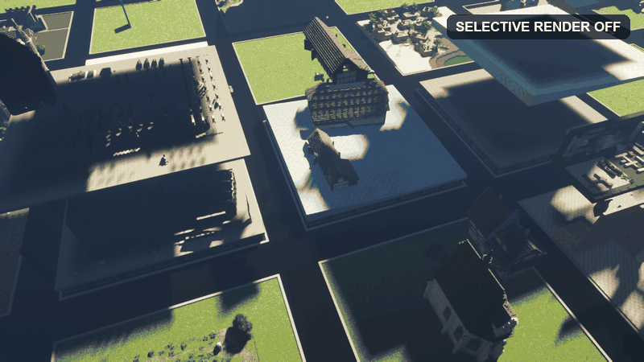

# Selective Render



Selective Render is a client-side Fabric mod for Minecraft 1.20.1. It keeps loaded
chunks, network traffic, world state, and collision unchanged while removing
everything outside a saved three-dimensional block region from the render lists.
This prevents hidden buildings and terrain from contributing geometry, lighting,
or shader shadows outside the selected area. Players remain visible everywhere;
all other entities, block entities, particles, block models, and fluids are
restricted to the active region.

## Usage

`/sr` is the short alias for `/selectiverender`; both command names provide the
same features.

1. Stand at one corner of the desired cuboid and run `/sr pos1`.
2. Stand at the diagonally opposite corner and run `/sr pos2`.
3. Run `/sr s NAME` to save the inclusive cuboid as a named preset.
4. Run `/sr t NAME` to enable it. Run the same command again to disable it.

Both positions use whole-block X, Y, and Z coordinates. Make sure the two corners
cover the full width, height, and depth you want to render. For example, one
position can be the lower north-west corner and the other the upper south-east
corner. The order of `pos1` and `pos2` does not matter, and both boundary blocks
are included.

Available short commands:

```text
/sr pos1
/sr pos2
/sr s NAME
/sr t NAME
/sr d NAME
/sr list
```

- `/sr s NAME` saves the current selection. A name is always required.
- `/sr t NAME` selects and toggles a saved preset.
- `/sr t` toggles the currently selected preset.
- `/sr d NAME` permanently deletes a preset.
- `/sr list` displays every saved preset and the currently selected one.

The long `save`, `toggle`, and `delete` subcommands remain available as
`/sr save NAME`, `/sr toggle NAME`, and `/sr delete NAME`.

The default keybind for toggling the currently selected preset is the physical
minus key, which is the `ß` key on German keyboard layouts. It can be reassigned
under Minecraft's Controls settings in the Selective Render category.

Presets and their enabled state are stored per server or single-player world
and dimension in `config/selectiverender/<sha256>.json`. The configuration is loaded
automatically when joining the world. The hashed file name prevents server
addresses from being exposed as file names.

Players are always rendered. Every other entity, block entity, and particle is
hidden outside the selected region.

## Implementation

- Vanilla sections are filtered in `WorldRenderer.addBuiltChunk` before terrain
  render lists and chunk rebuild work are created. Boundary chunks are retained,
  then individual block models and fluids are filtered by X/Y/Z block position.
- Sodium 0.5.x sections are filtered through `VisibleChunkCollector` before
  render lists, draw commands, and rebuild queues are created. While the filter
  is active, graph traversal remains independent of occlusion data from
  unrendered outer sections, allowing the region to remain visible from outside.
  Sodium's render-only world slice exposes blocks outside the cuboid as air, so
  standard and custom-rendered terrain is clipped at the exact block boundaries.
  Light samples beyond those boundaries use unobstructed sky light, preventing
  hidden terrain from darkening newly exposed cut faces. Vertical skylight is
  recalculated against occluding blocks inside the selected Y range, so roofs
  above the cuboid cannot leave baked darkness behind.
- Iris normal and shadow passes use the already filtered Vanilla or Sodium
  terrain lists, so geometry outside the region never enters a shadow pass.
- Entities, block entities, and particle geometry use separate render filters.

The mod does not change render distance, server packets, chunk loading, game
logic, or collision. Sodium support is optional and its mixins are skipped when
Sodium is not installed. The implementation does not use reflection.

The selected region must still be within the normal Minecraft render distance.
All region boundaries use inclusive whole-block coordinates. Existing horizontal
presets are migrated without a vertical limit so their previous behavior is kept.

## Building

Requirements: JDK 17 or newer and internet access for the first build.

```bash
./gradlew build
```

On Windows:

```powershell
.\gradlew.bat build
```

The installable file is generated at `build/libs/selective-render-1.2.4.jar`.
Fabric Loader and Fabric API are required. Sodium and Iris are optional.

## Target versions

- Minecraft 1.20.1
- Fabric API 0.92.2+1.20.1
- Sodium 0.5.x
- Iris for Minecraft 1.20.1

## License

MIT. See `LICENSE`.
